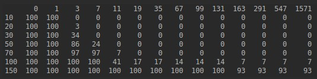
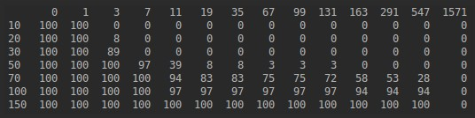
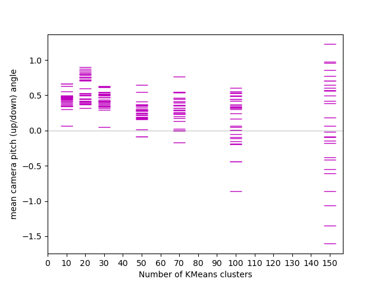
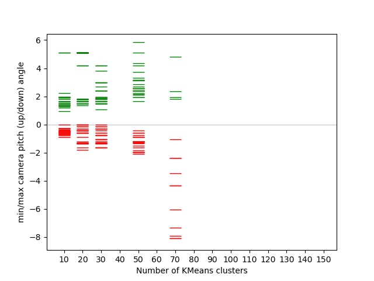

# MineRL-2020
Data analysis for team BeepBoop for MineRL 2020 competition

## Setting Up
Set `MINERL_DATA_ROOT` as environment variable or change it in `utils.py#8` to the location of your MineRL dataset.  
Generate action mapping pickle:
```
python action_mapping.py
```
## Action Frequency
Generate action frequencies as txt file.
```
python action_frequency.py
```
top 20 actions for ObtainDiamond data set look like this:
```
567086:('attack', 'camera: [0. 0.]')
457226:('camera: [0. 0.]',)
55032:('forward', 'camera: [0. 0.]')
38512:('forward', 'attack', 'camera: [0. 0.]')
27109:('sneak', 'attack', 'camera: [0. 0.]')
17064:('forward', 'jump', 'camera: [0. 0.]')
9565:('forward', 'sprint', 'camera: [0. 0.]')
5182:('forward', 'left', 'camera: [0. 0.]')
5085:('forward', 'sneak', 'attack', 'camera: [0. 0.]')
4629:('attack', 'camera: [ 0.15000153 -0.        ]')
4512:('forward', 'right', 'camera: [0. 0.]')
4192:('attack', 'camera: [ 0.14999962 -0.        ]')
3855:('sneak', 'camera: [0. 0.]')
3372:('forward', 'jump', 'sprint', 'camera: [0. 0.]')
3025:('back', 'camera: [0. 0.]')
2903:('attack', 'camera: [-0.15000153 -0.        ]')
2786:('attack', 'camera: [-0.          0.15002441]')
2777:('attack', 'camera: [-0.         -0.15002441]')
2430:('attack', 'camera: [-0.14999962 -0.        ]')
2375:('camera: [ 0.00019836 -0.        ]',)
```
Calculate how many trajectories each action appears in:
```
python each_action's_frequency_in_trajectories.py
```
top 20 actions look like this:
```
122:('forward', 'camera: [0. 0.]')
122:('camera: [0. 0.]',)
122:('attack', 'camera: [0. 0.]')
122:('forward', 'attack', 'camera: [0. 0.]')
117:('camera: [0. 0.]', 'craft: planks')
117:('camera: [0. 0.]', 'craft: stick')
117:('camera: [0. 0.]', 'nearbyCraft: wooden_pickaxe')
116:('camera: [0. 0.]', 'craft: crafting_table')
115:('forward', 'jump', 'camera: [0. 0.]')
111:('camera: [0. 0.]', 'nearbyCraft: stone_pickaxe')
105:('forward', 'left', 'camera: [0. 0.]')
104:('back', 'camera: [0. 0.]')
103:('attack', 'camera: [ 0.15000153 -0.        ]')
103:('camera: [0. 0.]', 'nearbyCraft: furnace')
101:('attack', 'camera: [-0.15000153 -0.        ]')
101:('forward', 'right', 'camera: [0. 0.]')
101:('left', 'camera: [0. 0.]')
99:('right', 'camera: [0. 0.]')
99:('camera: [0. 0.]', 'place: crafting_table')
98:('attack', 'camera: [ 0.14999962 -0.        ]')
```
This is a good way to find important non-camera actions in the obfuscated data set.
## Deobfuscate
Deobfuscate KMeans file (.pkl or .joblib) and calculate max reward:  
(For each centroid of given KMeans, finds the nearest obfuscated action in the mapping as measured by MSE)
```
python kmeans_from_file.py kmeans.joblib
```
Output will look like this:
```
('camera: [-0.        -0.1499939]', 'attack')
('camera: [-0.        -0.1499939]', 'forward')
('camera: [0. 0.]',)
('camera: [0. 0.]', 'forward', 'jump')
...
('camera: [-3.4500027  3.3000183]', 'jump')
('camera: [-1.5       5.100006]', 'forward')
('camera: [1.0500011 1.5      ]', 'jump')

Maximum possible reward: 1
```
This can help you figure out why your agent doesn't ever get to a higher reward - it might not have the required crafting actions, for example.
## An experiment to find the best number of clusters for kmeans
We run many iterations of KMeans with different numbers of clusters to find out the maximum rewards an agent can get. We also check the camera actions available (the agent sometimes doesn't even know how to look up).  
A note on n_actions: we compare running KMeans on the full ObtainDiamond data set (~2m actions) vs running it on 1m, 100k and 10k random actions from the data set. 100k gives almost the same results as 1m and 2m, but runs much faster, so we run our experiments using that. For training RL agents using the full data set is recommended.  

First we run the experiments and log results to `/out`:  
```
python kmeans_run_experiments.py
```
### Maximum possible rewards
We can see max rewards for each file with:  
```
python max_rewards_from_files.py
```

Max rewards vs n_clusters as tables:  
```
python max_rewards_tables.py
```
Obtain Diamond:  
  

Obtain Iron Pickaxe:  
  

We see that using n_clusters of 100 works well for ObtainIronPickaxe data, while ObtainDiamond needs at least 150 to be safe.  

### Camera Actions
Next we check camera actions. Many have noticed the tendency for their agents to look down more than up. This can be explained by the fact that camera action down is more common in the data set and KMeans tends to cluster more around those actions. It can be seen visually below (positive number = down):  
  
  
Lower kmeans n_clusters means that your mean vertical camera action will most likely be positive. The agent that chooses random actions in the initial exploration phase will quickly start looking straight down and mostly stay there.  
Even with higher n_clusters the camera actions will most likely be imbalanced and the exploration phase will either have lots of sky gazing or looking at the ground.  

We also checked the minimum (red) and maximum (green) vertical camera actions for each experiment:  
  
Zoomed in:  
  
If we zoom in, we can see that sometimes the minimum camera action is 0.0, which means that the agent doesn't have any up camera actions, only down!
